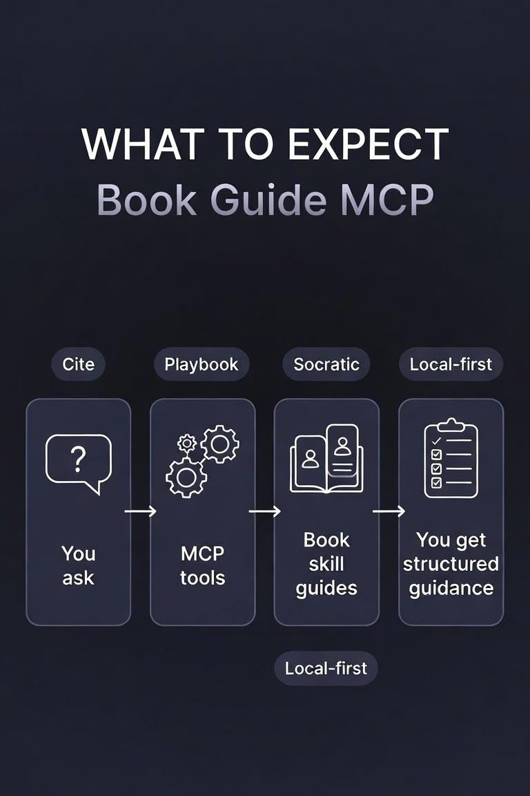

# Examples — what to expect

These walkthroughs show **real tool sequences** and **sample agent output** when Book Guide MCP is connected. No API keys. Demo skills ship with the repo.

| Example | You say… | Tools used | Infographic |
|---------|----------|------------|-------------|
| [01 — Socratic tutor](01-socratic-tutor.md) | “Quiz me on definitions” | `tutor_start` → `tutor_turn` | [flow](../assets/example-socratic-flow.svg) |
| [02 — Avicenna lens](02-avicenna-framework.md) | “Review this design methodically” | `skill_framework_apply` + cite | [flow](../assets/example-avicenna-flow.svg) |
| [03 — Import your book](03-import-your-book.md) | “Turn my handbook into a skill” | `skill_import_file` → playbook | [flow](../assets/example-import-flow.svg) |

### Master overview


<p align="center">
  
</p>

### First 60 seconds (any host)

```text
You:  List my book skills.
Agent → library_list
Expect: avicenna-canon, socratic-method (and any you imported)

You:  Teach me with Socratic questions.
Agent → tutor_start(book_id="socratic-method", mode="socratic")
Expect: one primary question — not a lecture
```

Full install: [USAGE.md](../USAGE.md)
